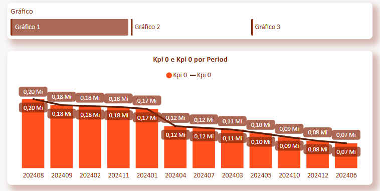
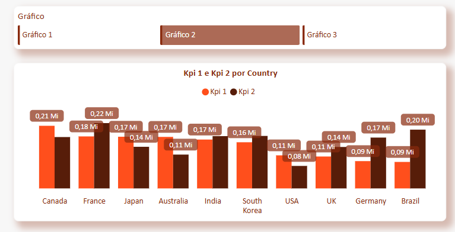
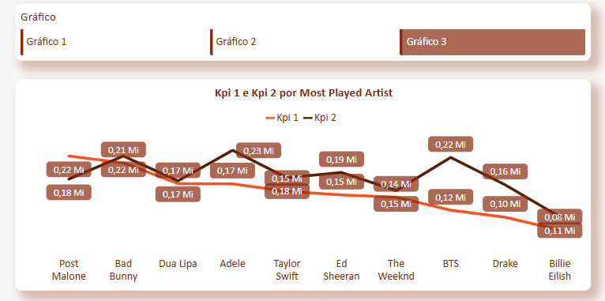
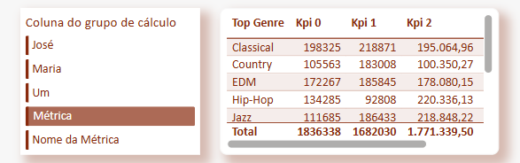
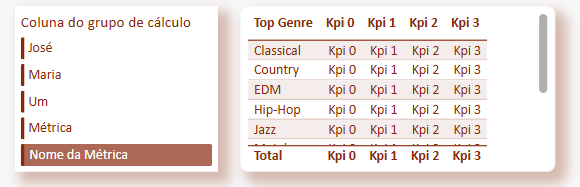
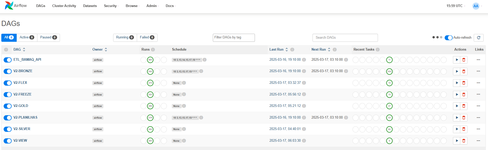
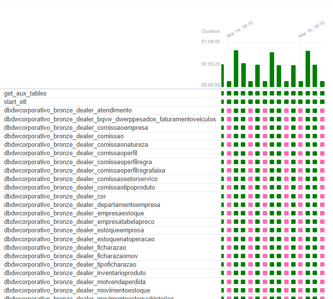

# 🚀 Trilha de Aprendizado - Recursos Avançados em Power BI

## Índice

- [📌 Visão Geral](#visão-geral)
- [🎯 Objetivos da Trilha](#objetivos-da-trilha)
- [🛠 Pré-requisitos](#pré-requisitos)
- [📚 Módulos](#módulos)
  - [🎨 Módulo 1: Temas no Power BI](#módulo-1-temas-no-power-bi)
  - [🖼️ Módulo 2: Construindo SVGs](#módulo-2-construindo-svgs)
  - [⚙️ Módulo 3: Avançando com Parâmetros](#módulo-3-avançando-com-parâmetros)
  - [📊 Módulo 4: Explorando Grupos de Cálculo](#módulo-4-explorando-grupos-de-cálculo)
  - [🛠️ Módulo Bônus: Case de Engenharia de Dados](#módulo-bônus-case-de-engenharia-de-dados)

---

## Visão Geral
Esta trilha foi criada para **compartilhar técnicas avançadas** em Power BI e Engenharia de Dados que aprendi, experimentei e implementei ao longo da minha jornada (Mesmo que breve 😅).  

**🚀 Objetivo:**  
Desejo ir além da teoria, capacitando os participantes na prática para gerar impacto real em suas entregas diárias.

---

## Objetivos da Trilha 
✅ Aprender a **personalizar completamente** temas no Power BI com JSON.  
✅ Criar gráficos **dinâmicos e interativos** com parâmetros avançados.  
✅ Utilizar **SVGs** para melhorar visualizações e criar elementos personalizados.  
✅ Explorar **Grupos de Cálculo** e como usá-los para viabilizar certas combinações e análises.  
✅ Conhecer **conceitos básicos de Engenharia de Dados**, incluindo Airflow e orquestração. 

---

## Pré-requisitos
Antes de começar, é recomendável ter conhecimentos básicos sobre:  

🔹 **Power BI** – Estrutura de relatórios e criação de gráficos.  
🔹 **DAX** – Noções de medidas e cálculos básicos.  
🔹 **Banco de Dados** – SQL básico é um diferencial.  
🔹 **Noções de JSON** – Para o módulo de temas personalizados.  

---

## Módulos

### Módulo 1: Temas no Power BI  
🔹 Criação de **temas personalizados via JSON**.  
🔹 Automatização de **design e cores** nos relatórios.  
🔹 Estrutura dos arquivos de temas e boas práticas.

#### Exemplo:
```json
{
  "name": "CY23SU02",
  "dataColors": [
    "#118DFF", "#12239E", "#E66C37", "#6B007B", "#E645AB", "#1C2325"
  ],
  "foreground": "#131312",
  "background": "#FFFFFF",
  "foregroundNeutralSecondary": "#6C6966",
  "backgroundLight": "#E5E0DA",
  "foregroundNeutralTertiary": "#ABA7A2",
  "backgroundNeutral": "#C6C2BE",
  "tableAccent": "#118DFF",
  "maximum": "#4A2D75",
  "center": "#1AAB40",
  "minimum": "#E645AB",
  "bad": "#E66C37",
  "neutral": "#6B007B",
  "good": "#12239E"
}
```
---

### Módulo 2: Construindo SVGs  
🔹 Utilização de **SVGs em Power BI** para enriquecer visualizações.  
🔹 Criando **ícones animados** dentro de relatórios.  
🔹 Como aplicar **SVGs como backgrounds personalizados**.

#### Exemplo:


---

### Módulo 3: Avançando com Parâmetros  
🔹 Uso avançado de **parâmetros** para criar gráficos interativos.  
🔹 Alternância dinâmica entre **métricas e dimensões**.  
🔹 Casos de uso reais aplicados a dashboards.  

#### Exemplo:


---

### Módulo 4: Explorando Grupos de Cálculo  
🔹 O que são **Grupos de Cálculo** e como utilizá-los.  
🔹 Aplicação para **cálculos dinâmicos** e análises flexíveis.  

#### Exemplo:


---

### Módulo Bônus: Case de Engenharia de Dados
🔹 **Introdução ao Apache Airflow** e sua importância.  
🔹 Como **orquestrar pipelines de dados** de forma eficiente.  
🔹 Integração entre **Airflow e Spark**.  
🔹 Apresentação de uma **Arquitetura de ETL Real**, desenvolvida no cliente.

#### Exemplo:
